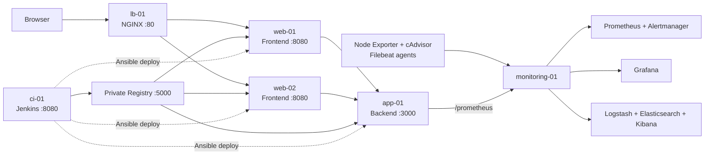

# Automation Alchemy - Cluster Chronicles

Cluster Chronicles migrates the completed Sherlock Logs VM infrastructure to Kubernetes. The deployable Minikube manifests, OptiPlex bootstrap, Jenkins/Kaniko/Trivy pipeline, persistent storage, HPA, Prometheus/Grafana monitoring, EFK logging, and review runbook are documented in [k8s/README.md](k8s/README.md).

Quick start on the OptiPlex:

```bash
bash scripts/k8s/bootstrap-optiplex.sh
bash scripts/k8s/deploy.sh
bash scripts/k8s/smoke-test.sh
```

## Source Platform: Sherlock Logs

Automation Alchemy is a reproducible local DevOps environment built on six Ubuntu virtual machines. It provisions a load-balanced containerized application, a Jenkins CI/CD pipeline with a private Docker Registry and rollback support, and a complete metrics and centralized logging platform.

The entire environment can be created from a clean state with Vagrant and Ansible. It is intended as an educational infrastructure project and demonstrates infrastructure as code, service isolation, deployment automation, observability, alerting, and operational recovery.

## Highlights

- Six Ubuntu 22.04 VMs created with Vagrant and VirtualBox
- Idempotent Ansible roles for provisioning and deployment
- NGINX load balancing across two frontend servers
- Containerized Node.js backend and NGINX frontend
- Jenkins Configuration as Code and a pipeline stored in the repository
- Versioned images in a private Docker Registry
- Validated application rollback without rebuilding images
- Prometheus metrics from Node Exporter, cAdvisor, the application, and Elasticsearch
- Provisioned Grafana dashboards and Prometheus alert rules
- Filebeat, Logstash, Elasticsearch, and Kibana centralized logging
- UFW network restrictions and key-only SSH access
- Automated health checks and observability smoke tests

## Architecture



Application traffic follows this path:

```text
Browser -> lb-01:80 -> web-01:8080 / web-02:8080 -> app-01:3000
```

The frontend instances proxy API requests to the backend. Jenkins builds and pushes versioned images to the local registry, then uses Ansible to deploy the selected tag.

### Virtual machines

| VM | IP address | vCPU | RAM | Primary role |
|---|---:|---:|---:|---|
| `lb-01` | `192.168.56.10` | 1 | 640 MB | NGINX load balancer |
| `web-01` | `192.168.56.11` | 1 | 640 MB | Frontend container |
| `web-02` | `192.168.56.12` | 1 | 640 MB | Frontend container |
| `app-01` | `192.168.56.13` | 1 | 768 MB | Backend container |
| `ci-01` | `192.168.56.14` | 2 | 2048 MB | Jenkins and Docker Registry |
| `monitoring-01` | `192.168.56.15` | 2 | 4096 MB | Metrics, alerting, logs, and dashboards |

The VMs are assigned 8 vCPUs and 8,832 MB of RAM in total.

## Technology Stack

| Area | Technologies |
|---|---|
| Virtualization | Vagrant, VirtualBox, Ubuntu 22.04 |
| Automation | Ansible, Bash, Make |
| Application | Node.js, Express, NGINX, Docker |
| Traffic | NGINX load balancer and reverse proxies |
| CI/CD | Jenkins, Jenkins Configuration as Code, private Docker Registry |
| Metrics | Prometheus, Node Exporter, cAdvisor, Elasticsearch Exporter |
| Dashboards and alerts | Grafana, Alertmanager, Prometheus rules |
| Centralized logging | Filebeat, Logstash, Elasticsearch, Kibana |
| Security | UFW, SSH key authentication, restricted service ports |

## Prerequisites

The project is designed for a Windows host with:

- VirtualBox
- Vagrant
- WSL2 with an Ubuntu distribution
- Ansible, Make, Python 3, curl, and OpenSSH installed in WSL
- At least 12 GB of host RAM recommended
- At least 60 GB of free disk space recommended

Install the Ansible collection used by the firewall role:

```bash
ansible-galaxy collection install community.general
```

Vagrant commands should be run from PowerShell. Ansible and Make commands should be run from WSL inside the project directory.

Before the first provisioning run, make sure `ssh_key_dir` in `ansible/inventory.ini` points to the same WSL directory used by `scripts/sync-vagrant-keys.sh`:

```ini
ssh_key_dir=/home/<wsl-user>/.ssh/automation-alchemy
```

## Quick Start

### 1. Start the VMs

From PowerShell in the repository root:

```powershell
vagrant up --no-parallel
vagrant status
```

All six machines should report `running`.

### 2. Provision the environment

Open WSL and enter the repository:

```bash
cd /mnt/c/Users/<windows-user>/path/to/automation-alchemy-final
make provision
```

`make provision` performs the complete workflow:

1. Reads optional values from `.env`.
2. Synchronizes the Vagrant SSH keys for Ansible.
3. Bootstraps the `devops` user when needed.
4. Applies security and SSH hardening.
5. Installs Docker on the required hosts.
6. configures Jenkins and the private registry.
7. Builds, pushes, and deploys the application images.
8. Configures the load balancer.
9. Deploys the monitoring and logging stack.
10. Installs the metrics and logging agents.

Provisioning pulls several large monitoring images and can take time on the first run.

### 3. Verify the deployment

```bash
make ping
make app-test
make sherlock-test
make monitoring-status
```

The application should then be available at [http://192.168.56.10](http://192.168.56.10).

## Optional Environment Configuration

The local `.env` file is ignored by Git. It can contain:

```dotenv
DEVOPS_PASSWORD=your-local-devops-password
DISCORD_REVIEW_WEBHOOK_URL=https://discord.com/api/webhooks/...
```

`DEVOPS_PASSWORD` defaults to `devops` when it is not supplied. `DISCORD_REVIEW_WEBHOOK_URL` is optional; when present, Jenkins sends deployment and rollback results to Discord. Do not commit real webhook URLs or other secrets.

## Service Endpoints

| Service | Address | Credentials |
|---|---|---|
| Application | [http://192.168.56.10](http://192.168.56.10) | None |
| Application health through LB | [http://192.168.56.10/api/health](http://192.168.56.10/api/health) | None |
| Jenkins | [http://192.168.56.14:8080](http://192.168.56.14:8080) | `admin` / `admin` |
| Docker Registry | [http://192.168.56.14:5000/v2/_catalog](http://192.168.56.14:5000/v2/_catalog) | None |
| Prometheus | [http://192.168.56.15:9090](http://192.168.56.15:9090) | None |
| Alertmanager | [http://192.168.56.15:9093](http://192.168.56.15:9093) | None |
| Grafana | [http://192.168.56.15:3000](http://192.168.56.15:3000) | `admin` / `sherlock` |
| Elasticsearch | [http://192.168.56.15:9200](http://192.168.56.15:9200) | None |
| Kibana | [http://192.168.56.15:5601](http://192.168.56.15:5601) | None |

All credentials are local demonstration credentials. The environment is not intended to be exposed to an untrusted network.

## Application

The backend is a small Express service with structured JSON logging and Prometheus instrumentation.

| Endpoint | Purpose |
|---|---|
| `/health` | JSON health response |
| `/metrics` | JSON server information used by the frontend |
| `/prometheus` | Prometheus-format application metrics |
| `/simulate-error` | Generates a controlled HTTP 500 and error log for demonstrations |

The backend records request counts, request duration histograms, response status labels, runtime metrics, and a custom operation counter. The two frontend containers display runtime information and proxy API requests to the backend.

## CI/CD Pipeline

Jenkins is configured automatically from `ci/jenkins/casc.yaml`. The `automation-alchemy-deploy` job executes `ci/Jenkinsfile` from the configured Git repository and branch.

Before using a fork or a school repository, update the repository URL and branch in `ci/jenkins/casc.yaml`, then apply the Jenkins configuration again:

```bash
make jenkins-restore
```

Pipeline stages:

1. Check out source code.
2. Validate Grafana dashboard JSON and Prometheus configuration/rules.
3. Select normal deployment or rollback mode.
4. Validate a requested rollback tag.
5. Build backend and frontend images for normal deployments.
6. Push versioned and `latest` tags to the private registry.
7. Deploy the application with Ansible.
8. Deploy or refresh observability.
9. Run application and Sherlock Logs smoke tests.
10. Send an optional Discord result notification.

Normal builds create matching image tags:

```text
192.168.56.14:5000/automation-backend:<jenkins-build-number>
192.168.56.14:5000/automation-frontend:<jenkins-build-number>
```

To run a normal deployment, open Jenkins, select `automation-alchemy-deploy`, and choose **Build Now**.

## Rollback

Rollback redeploys an existing pair of image tags without rebuilding them. The workflow validates that the requested tag exists for both images before changing the running containers.

From WSL:

```bash
make image-tags
make deployed-images
make rollback VERSION=<existing-build-number>
```

Rollback can also be demonstrated from Jenkins by starting `automation-alchemy-deploy` with the `ROLLBACK_TAG` parameter.

## Observability

### Metrics

Prometheus scrapes:

- Node Exporter on all six VMs
- cAdvisor on all Docker hosts
- the backend `/prometheus` endpoint
- Prometheus itself
- Elasticsearch Exporter

Metrics are retained for seven days. Grafana automatically provisions the Prometheus datasource and three dashboards in the `Sherlock Logs` folder:

- **VM Performance** - CPU, memory, disk I/O, and network traffic
- **Docker Containers** - running containers, CPU, memory, and restart activity
- **Application Performance** - request rate, latency, errors, and custom operations

Docker 29 uses the containerd image store. cAdvisor is therefore started with disk container metrics disabled to avoid the current `overlayfs` layer lookup incompatibility. CPU, memory, network, metadata, and restart metrics remain available; host disk metrics are collected by Node Exporter.

### Alerting

Provisioned Prometheus rules cover:

- high VM CPU and memory usage
- low VM disk space
- unreachable VM exporters
- frequent container restarts
- high container memory usage
- unhealthy Elasticsearch cluster state
- combined CPU and memory pressure
- elevated application HTTP 5xx rate

Alerts can be inspected in Prometheus and Alertmanager.

### Centralized logging

The logging path is:

```text
VM and container logs -> Filebeat -> Logstash -> Elasticsearch -> Kibana
```

Filebeat collects system logs from every VM and Docker JSON logs from Docker hosts. Logstash separates events into these index families:

- `system-logs-*`
- `application-logs-*`
- `docker-logs-*`

Kibana saved objects are imported automatically during provisioning.

## Security Model

The project applies practical controls for a local lab:

- SSH password authentication is disabled.
- Root SSH login is disabled.
- Only the `devops` user is allowed over SSH after hardening.
- UFW defaults to denying incoming traffic.
- Frontend ports accept traffic only from the load balancer.
- The backend accepts application traffic only from the frontend servers.
- Exporter ports accept scrape traffic only from the monitoring server.
- Monitoring interfaces are limited to the host-only `192.168.56.0/24` network.
- Sensitive Jenkins environment data is written with restricted permissions.

This is an educational local environment. It intentionally uses HTTP, a single-node Elasticsearch cluster, and demonstration credentials; additional hardening would be required for production use.

## Useful Commands

| Command | Description |
|---|---|
| `make up` | Start all VMs without parallel boot |
| `make status` | Show VM state |
| `make sync-keys` | Synchronize Vagrant SSH keys for Ansible |
| `make ping` | Test Ansible connectivity |
| `make provision` | Provision the complete environment |
| `make observability` | Redeploy monitoring, logging, and agents |
| `make app-test` | Run application health checks |
| `make sherlock-test` | Validate monitoring endpoints, targets, rules, and log indices |
| `make monitoring-status` | Show monitoring container status |
| `make monitoring-logs` | Show recent monitoring container logs |
| `make registry-test` | Query the Registry catalog |
| `make registry-smoke` | Push and pull a test image through the Registry |
| `make image-tags` | List backend and frontend tags |
| `make deployed-images` | Show the currently deployed images |
| `make rollback VERSION=<tag>` | Redeploy an existing image version |
| `make jenkins-status` | Show Jenkins container status |
| `make jenkins-logs` | Show recent Jenkins logs |
| `make jenkins-restore` | Reapply Jenkins Configuration as Code |
| `make security-check` | Inspect the hardened user and sudo configuration |
| `make ssh-negative-test` | Verify that forbidden SSH users are rejected |
| `make discord-test` | Send an optional Discord test notification |
| `make destroy` | Destroy all Vagrant VMs |

## Project Structure

```text
.
|-- Vagrantfile                     # Six-VM topology
|-- Makefile                        # Operator commands
|-- ansible/
|   |-- inventory.ini               # Host groups and SSH configuration
|   |-- bootstrap.yml               # Initial devops-user bootstrap
|   |-- site.yml                    # Full infrastructure provisioning
|   |-- deploy.yml                  # Application deployment
|   |-- rollback.yml                # Validated rollback
|   |-- observability.yml           # Monitoring/logging deployment
|   `-- roles/                       # Reusable Ansible roles
|-- app/
|   |-- backend/                    # Express application and Dockerfile
|   `-- frontend/                   # Static frontend, NGINX, and Dockerfile
|-- ci/
|   |-- Jenkinsfile                 # CI/CD pipeline
|   `-- jenkins/                    # Jenkins image, plugins, and JCasC
|-- monitoring/
|   |-- docker-compose.yml          # Central observability stack
|   |-- prometheus/                 # Scrape and alert configuration
|   |-- grafana/                    # Provisioned datasource and dashboards
|   |-- alertmanager/               # Alert routing
|   |-- logstash/                   # Log processing pipeline
|   `-- kibana/                     # Saved objects
`-- scripts/                        # Bootstrap, smoke tests, and operations
```

## Demo Checklist

For a short project review:

```bash
make status
make ping
make app-test
make sherlock-test
make deployed-images
```

Then demonstrate:

1. Application load balancing at `http://192.168.56.10`.
2. A successful Jenkins pipeline build.
3. The three Grafana dashboards.
4. Prometheus targets and alert rules.
5. Kibana system, application, and Docker logs.
6. A rollback to a previous Jenkins build tag.

## Troubleshooting

### Ansible cannot connect

```bash
make sync-keys
make ping
```

If the VMs were rebuilt, always synchronize their new Vagrant keys before provisioning.

### Prometheus, Grafana, or Kibana is not ready

```bash
make monitoring-status
make monitoring-logs
make observability
```

Elasticsearch and Kibana may need several minutes to become ready after a cold start.

### Grafana dashboards are empty

First confirm that Prometheus targets are `UP` at `http://192.168.56.15:9090/targets`, then rerun:

```bash
make observability
```

Refresh Grafana after the playbook completes. The Ansible role enforces readable provisioning permissions and deploys the Docker 29-compatible cAdvisor configuration.

### Jenkins cannot check out the repository

Verify the Git URL and branch in `ci/jenkins/casc.yaml`, push that branch, and run:

```bash
make jenkins-restore
```

### A rollback tag is rejected

```bash
make image-tags
```

The tag must exist for both `automation-backend` and `automation-frontend`, and `latest` is intentionally rejected as a rollback target.

### Vagrant runs out of host resources

Stop other VMs and containers, ensure sufficient free disk space, and start the machines sequentially with `vagrant up --no-parallel`.

## Cleanup

Destroy the lab from PowerShell:

```powershell
vagrant destroy -f
```

This removes the six VMs. Repository files remain unchanged.
